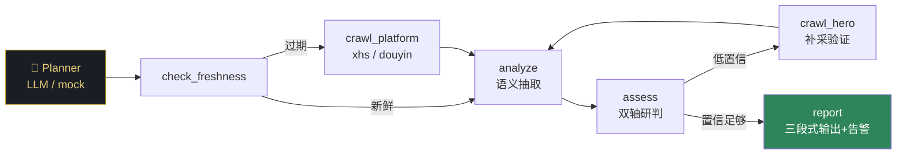

<p align="center">
  
  
  
  
</p>

<h1 align="center">🎮 MOBA 英雄强度舆情监控 Agent</h1>

<p align="center">
  <b>自动采集玩家舆情 × 客观双轴数据交叉验证 → 找出真正该动的英雄</b><br>
  以《王者荣耀》为例，方法论可迁移至任意 MOBA
</p>

---

## 💡 一句话

> 舆情告诉我「谁在被骂」，数据回答「骂得对不对」—— 交叉后给出分型、评级与调整建议，告警去重防疲劳，人工一条命令闭环。

---

## ✨ 核心特性

| | 特性 | 说明 |
|---|---|---|
| 🤖 | **Agent 自主决策** | ReAct 循环：Planner(LLM/mock) 每步选 tool，自判是否补采验证、跳过或出报告 |
| 🕷️ | **自动爬取** | 集成 MediaCrawler，小红书+抖音 24h 自动采集，headless + 超时进程树 kill |
| 📊 | **双轴 z-score 模型** | 竞技轴(巅峰千强) × 大众轴(全分段)，全英雄统一算 μ/σ，自适应版本更迭 |
| 🎯 | **9 种英雄分型** | 真超标 / 高手向 / 两极分化 / 低端友好 / 泛用霸榜 / 绝活哥 / 弱势 … |
| 🔕 | **告警去重防疲劳** | 4 桶分优先级 + 人工闭环抑制，不会"半个英雄池糊脸" |
| 🧯 | **舆情置信度门控** | 5 因子(离散度/样本/方向/跨平台/时间)算置信度，抗羊群/单条爆帖/口水战，低置信只记录不提级 |
| 📝 | **原文溯源** | 每条判定带原始评论(前120字)，可人工核验 |
| 🛡️ | **绝活哥双轴防护** | 高胜+冷门+无人ban → 高胜不作数，避免误判小样本 |

---

## 🏗️ 架构



**固定管道模式**仍可用（`python -m src.skills.report`），Agent 模式是其超集。

---

## 📐 双轴模型

|  | **大众轴 强** | **大众轴 弱** |
|---|---|---|
| **竞技轴 强** | 🔴 **真超标** → 削弱 | 🟡 **高手向 / 两极分化** → 削上限 |
| **竞技轴 弱** | 🔵 **低端友好** → 维持（削则伤大众） | 🟢 **真弱势** → 加强 |

> 绝活哥防护：巅峰高胜 + 冷门(z_pick < -0.5) + ban率不高 → 高胜不作数  
> ban率高 ≠ 强：瑶/鲁班被ban是"烦"非"强"，ban只在胜率不弱时才正向确认

---

## 🚀 快速开始

```bash
# 1. 安装依赖
pip install -r requirements.txt

# 2. (可选) 配置 LLM — 不配走 mock planner，数据研判不受影响
cp .env.example .env  # 填 LLM_API_KEY / LLM_BASE_URL / LLM_MODEL

# 3. (可选) 安装 MediaCrawler 用于自动爬取
#    git clone https://github.com/NanmiCoder/MediaCrawler.git
#    放到同级目录，crawl.py 自动识别；不装则跳过爬取步骤，用已有数据跑

# 4. 放入 CSV 数据 (天元之弈数据站导出)
#    data/heroes_YYYYMMDD_5.csv  (巅峰千强)
#    data/heroes_YYYYMMDD_1.csv  (全分段)

# 4. 运行
python -m src.agent              # Agent 自主决策模式
python -m src.skills.report      # 固定管道模式
python -m src.skills.dashboard   # 生成动态 HTML 数据看板 (Chart.js)
python -m src.skills.crawl       # 强制爬取一轮
python -m src.main               # 常驻：每小时自动巡检
```

---

## 📺 运行样例

```
==================================================================
王者荣耀英雄强度监控 Agent  2026-08-10 16:03:10  [mock]
==================================================================

──────────────────────────────────────────────────
Step 1 │ 🤖 决策：check_freshness({})
       │ 💭 理由：第一步：检查数据是否过期
──────────────────────────────────────────────────
  xhs：数据 0.9h 前落盘，跳过爬取
  douyin：数据 0.7h 前落盘，跳过爬取

──────────────────────────────────────────────────
Step 2 │ 🤖 决策：analyze({})
       │ 💭 理由：数据新鲜，直接分析
──────────────────────────────────────────────────
采集 389 条，命中词条 129 条，涉及英雄 48 个｜数据质量：ok

【一】舆情呼声榜（玩家呼声从高到低）
No.1 ➖持续 【海月】呼声 35.0（削35.0/强0.0，18条，倾向该削）
     🔴 数据研判：两极分化 → 建议 削上限补下限
No.2 ➖持续 【卢雅那】呼声 25.4（削18.1/强7.3，16条，倾向该削）
     🟡 数据研判：泛用霸榜 → 建议 削弱
...

========================🔔 [告警推送]========================
—— ①舆情+数据双印证 ——
• 【盾山】高手向 → 建议削弱 [medium]
• 【关羽】两极分化 → 削上限补下限 [high]
—— ③结构性 ——
• 【海月】两极分化 → 削上限补下限 [high] ban90%
—— ②数据盲区 Top5 ——
• 【少司缘】高手向 → 削弱 [medium]
============================================================
```

---

## 📁 项目结构

```
wzry-hero-balance/
├── src/
│   ├── agent.py            # Agent ReAct 决策循环 (LLM/mock planner)
│   ├── agent_tools.py      # 工具注册：6 tools
│   ├── config.py           # 阈值配置中心 (z-score, 抑制参数)
│   ├── main.py             # 入口：APScheduler 每小时巡检
│   ├── models/
│   │   └── schemas.py      # Pydantic 数据模型
│   ├── skills/
│   │   ├── crawl.py        # 自动爬取 (MediaCrawler subprocess)
│   │   ├── collect.py      # 数据采集 + 去重
│   │   ├── analyze.py      # 语义分析 (LLM/离线归档)
│   │   ├── aliases.py      # 别名/黑话 → 规范名
│   │   ├── aggregate.py    # log 加权投票聚合
│   │   ├── metrics.py      # CSV 客观数据读取
│   │   ├── baseline.py     # 跨时间 z-score (新增/突增)
│   │   ├── risk.py         # 双轴分型 + 跨英雄 z-score
│   │   ├── notify.py       # 4桶告警 + 闭环抑制
│   │   ├── storage.py      # SQLite 持久化
│   │   ├── dashboard.py    # 动态 HTML 看板 (Chart.js 内联, 单文件)
│   │   ├── report.py       # 固定管道编排
│   │   └── ack.py          # 人工处置 CLI
│   └── utils/
│       └── llm.py          # LLM 调用封装 (OpenAI 协议)
├── data/
│   ├── heroes_*_5.csv      # 巅峰千强数据
│   ├── heroes_*_1.csv      # 全分段数据
│   ├── mentions/           # 语义分析归档 (按批次)
│   └── monitor.db          # SQLite (快照/数据轴metrics/积压/抑制/ground_truth)
├── requirements.txt
└── .env.example
```

---

## ⚙️ 关键阈值

| 参数 | 值 | 含义 |
|---|---|---|
| `Z_STRONG` / `Z_WEAK` | +1.0 / -1.0 | 胜率偏离 ±1σ → 偏强/偏弱候选 |
| `Z_BAN_CONFIRM` | 0.5 | ban率 z ≥ 此 → 强度被公认 |
| `Z_PICK_DOMINANT` | 1.5 | 出场率 z ≥ 此 → 泛用霸榜 |
| `Z_CEILING` | 0.5 | 上限偏高信号 |
| `SURGE_Z` | 2.0 | 呼声突增预警阈值 |
| `SURGE_MIN_HISTORY` / `SURGE_SIGMA_FLOOR` | 3 / 0.15 | 突增防爆：快照<3不判；σ 封底防历史退化时 z 爆炸 |
| `VOICE_CONF_MIN` | 0.4 | 舆情置信度门槛，低于此只记录不提级 |
| `BACKLOG_ALERT_ROUNDS` | 3 | 连续 N 轮未解决 → 陈年欠账 |

全部集中在 `src/config.py`，用 z-score 而非硬编码百分比，**跨版本自适应**。

---

## 🔄 人工闭环

```bash
python -m src.skills.ack <英雄> <处置> [抑制轮数] [备注]

# 例：
python -m src.skills.ack 盾山 已改 24 "S44中版本削了平A"
```

| 处置 | 效果 |
|---|---|
| `误报` | 告警不对，抑制 N 轮 |
| `已关注` | 短暂降噪，仍计积压 |
| `需跟进` | 冻结积压计数 |
| `已改` | 清零积压，记入 ground_truth |

---

## 🗺️ Roadmap

- [x] 双轴 z-score 分型模型
- [x] MediaCrawler 自动爬取集成
- [x] Agent ReAct 决策循环
- [x] 批次校验 · 拒绝静默降级
- [x] 动态 HTML 看板 (Chart.js 内联, 单文件离线可用)
- [x] 舆情置信度门控 (5 因子抗羊群)
- [x] 数据轴快照落库 (metrics 表，供回测溯源)
- [ ] 接真 LLM (DeepSeek/通义) 端到端
- [ ] 推送通道 (飞书/webhook)
- [ ] ground_truth 回测优化阈值

---

## 📄 License

MIT

---

<p align="center">
  <i>舆情为主 · 数据为验证器 · 记忆/基线/容错/闭环齐备</i>
</p>
